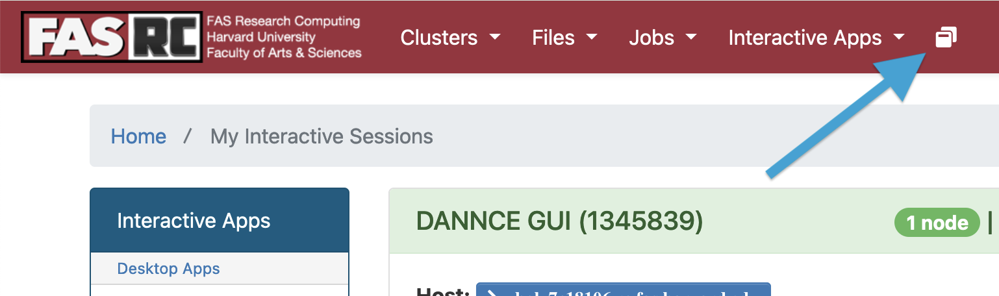

# Open On Demand setup for dannce-gui

Initial setup
NOTE: these steps apply to the FASRC cannon cluster, but are likely simliar for any SLURM cluster which supports OOD interacive apps.

0. clone the newsdannce repo to a folder on your machine (likely already done by this point)
1. connect to the FASRC cluster over ssh
2. On the cluster terminal: make the dev directory with the following:

`mkdir -p ~/.fasrcood/dev/gui_ood`

3. close the ssh connection to the cluster
4. from a terminal on your local machine (NOT SSH), the variable with the following command:
```
RC_USERNAME="ENTER_YOUR_RC_USERNAME_HERE"
NEWSDANNCE_FOLDER_PATH="PATH_TO_NEWSDANNCE_FOLDER_HERE"
```
E.g. for me, I might run:
```
RC_USERNAME=caxon
NEWSDANNCE_FOLDER_PATH=/Users/caxon/olveczky/newsdannce
```

5. Run the following command to upload the OOD code to the clustser:

`rsync -avhP $NEWSDANNCE_FOLDER_PATH/apps/gui_ood/ $RC_USERNAME@login.rc.fas.harvard.edu:~/.fasrcood/dev/gui_ood/ --delete`

6. Connect to the FASRC vpn [instructions here](https://docs.rc.fas.harvard.edu/kb/vpn-setup/)

7. Go to the FASRC OpenOnDemand Dashboard: [link](https://rcood.rc.fas.harvard.edu). Note: if this page never loads, make sure you are **connected to the fasrc vpn**.
8. Click on the shelf icon in the right corner to take you to the My Interactive Sessions page:
9. Click on "DANNCE GUI" on the left side, under "Interactive Apps"
10. You should see a form with the header DANNCE GUI (see image) 

Fill out this form with the following entries:

a. **Account**: use your fasrc billing account. If you are in a lab this is likely your lab account name; e.g. `olveczkylab` or `univ_rc`. If you are unsure, you can connect to the cluster through a terminal over ssh (e.g. ssh $RC_USERNAME@login.rc.fas.harvard.edu) and run:

```
sacctmgr show association user=YOUR_RC_USERNAME_HERE format=account%50
```

b. **partition**: this is the cluster partition where the job will be run. Choose a partition you have access to. NOTE: this partition **should not have GPU's**, as the DANNCE GUI will allocate jobs on different partitions to run training/inference. E.g. value: `sapphire`

c. **number of hours**: Number of hours to allocate to this for the dannce_gui. You will not be able to use the GUI once this time expires; however, you can re-launch the DANNCE GUI interactive job later to use it again. Make sure this value does not excede max runtime for the partition you're using. E.g. value: `12`

d. **Number of Cores**: Number of cores to allocate for the DANNCE GUI process. E.g. 8.

e. **Instance Directory***: Where your dannce gui data will be stored. This includes video files, prediction files, slurm sbatch logs, etc. This should not be part of your home directory, as it will be very slow to access. This should likely be a new directory on luster or isilon. If the folder does not exist it will be created. E.g. `/n/holylabs/LABS/olveczky_lab/Users/caxon/dannce-gui-instance`

f. **Sdannce Container Path**: Path to a apptainer/singularity container for sdannce. See the instructions for building this in the newsdannce/core/singularity folder. This container will be launched to run sdannce training and inference. E.g. /n/holylabs/LABS/olveczky_lab/Lab/singularity2/sdannce/sdannce-20241210.sif


Once all the fields are filled out, click: "Launch". This may take a few minutes (or porentially hours), depending on long the cluster queue is. It will likely take under 60 seconds if the partition you're using is not too busy.

When this button appears, click on "Open Dannce GUI" . If the page says "Not found", wait about 30 seconds and try again.

Contgratulations! Now you are running the dannce gui and you can proceed to the DANNCE GUI user instructions.
